

  
  <h2> 흩어진 쿠폰 한번에 관리하자! </h2>
 
<a href="https://www.stampcrush.site/">서비스 소개</a>
 
<a href="https://www.stampcrush.site/admin">사장 모드</a>
 
<a href="https://www.stampcrush.site/counpon-list">고객 모드</a>
   
   
  <strong>스탬프크러쉬</strong>는 온라인 쿠폰 적립 및 관리 플랫폼으로
   
  카페 사장님에게 개성 있는 쿠폰 제작과 고객에게 간편한 적립을 제공해주는 서비스입니다.
   
   

[서비스 소개글 바로가기](https://github.com/woowacourse-teams/2023-stamp-crush/wiki)

[서비스 소개 페이지 바로가기](https://sites.google.com/woowahan.com/woowacourse-demo-5th/프로젝트/스탬프크러쉬)

# 주요 기능 소개

## 쿠폰 커스텀 기능(사장 모드)

### 쿠폰 제작 방식 선택( 템플릿 / 커스텀 )

  <table>
    <tr>
      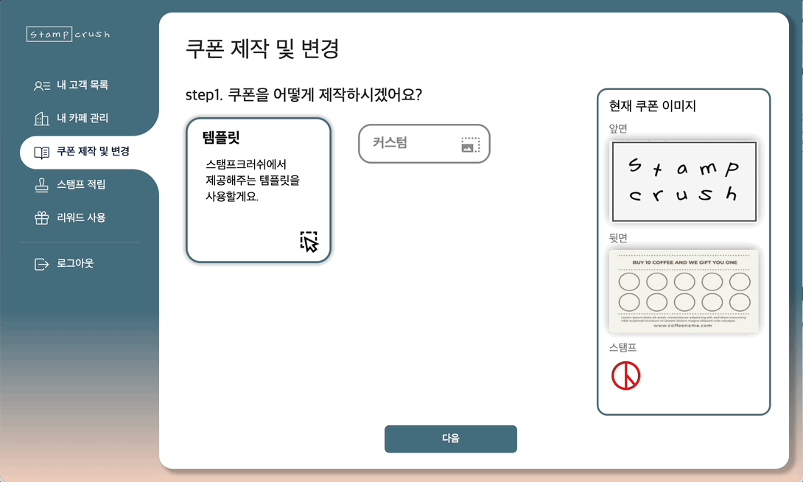
    </tr>
  </table>
     
     

  <table>
    <tr>
      <td>
      <h3>템플릿</h3>
        
스탬프크러쉬가 <strong>제공하는 템플릿을 이용</strong>하여 쿠폰을 디자인할 수 있습니다.

      </td>
      <td>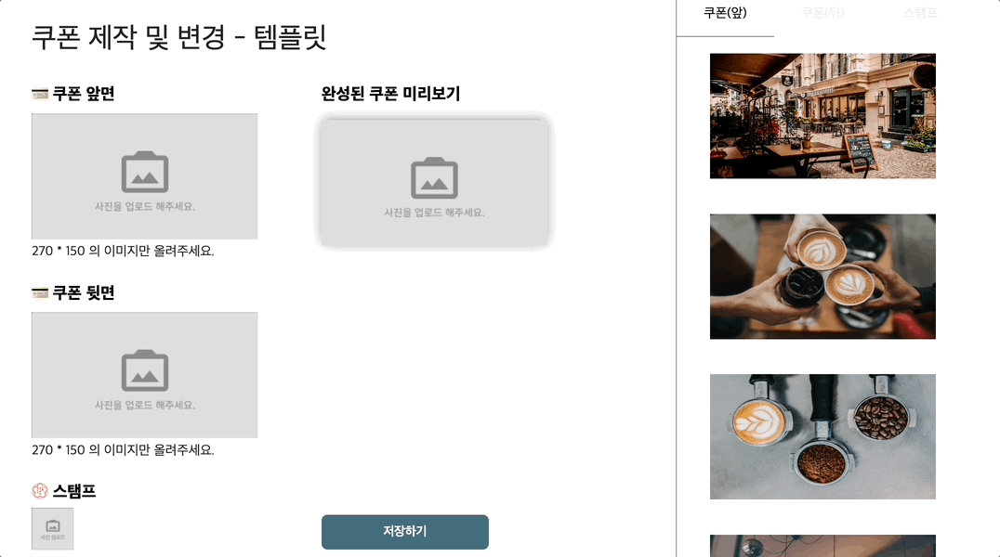</td>
    </tr>
    <tr>
      <td>
        <h3>커스텀</h3>
        
사용자가 <strong>직접 업로드한 파일을 이용</strong>하여 쿠폰 디자인을 커스터마이징할 수 있습니다.

      </td>
      <td>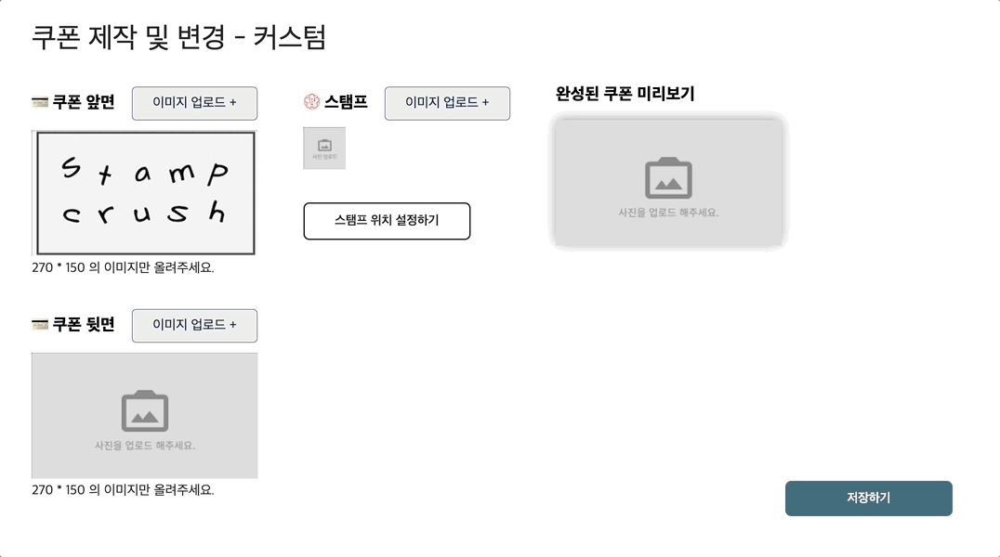</td>
    </tr>
  </table>

   

### 스탬프 위치 커스터마이징

  <table>
    <tr>
      <td>쿠폰에 찍힐 <strong>스탬프 좌표와 순서를 커스터마이징</strong>하고 S3에 이미지를 업로드합니다.</td>
    </tr>
    <tr>
      <td>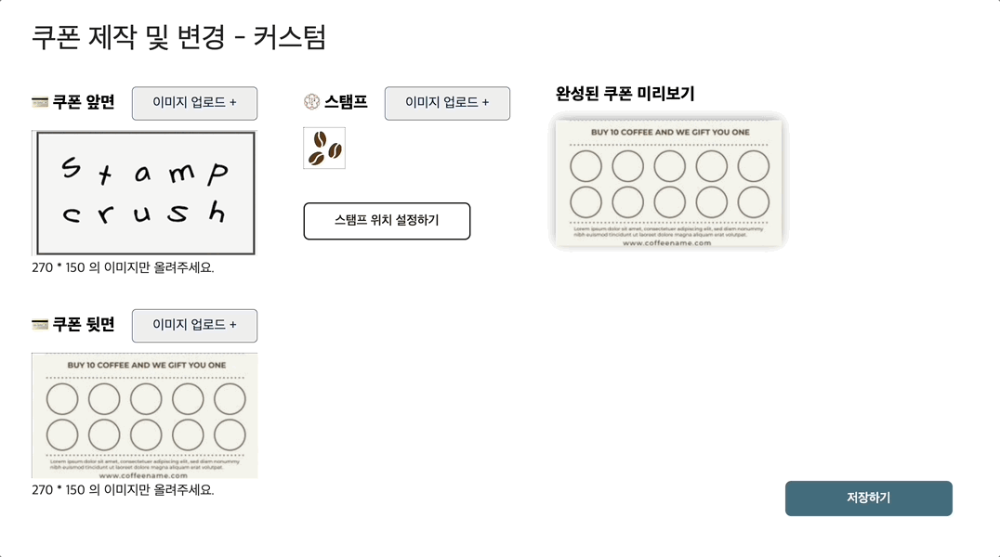</td>
    </tr>
  </table>

   
   

## 스탬프 적립(사장 모드)

  <table>
    <tr>
      <td>
        <h3>DB 미보유 전화번호</h3> 
        
첫 방문 고객 확인 / 전화번호 입력 실수 방지를 위해 DB에 존재하지 않는 번호 입력 시 알림을 띄웁니다.
</td>
      <td>
        <h3>DB 보유 전화번호</h3> 
        
입력받은 전화번호로 회원/비회원, 쿠폰 보유 여부, 스탬프 개수, 쿠폰 디자인 등 고객의 정보를 요청/응답합니다.

      </td>
    </tr>
    <tr>
      <td>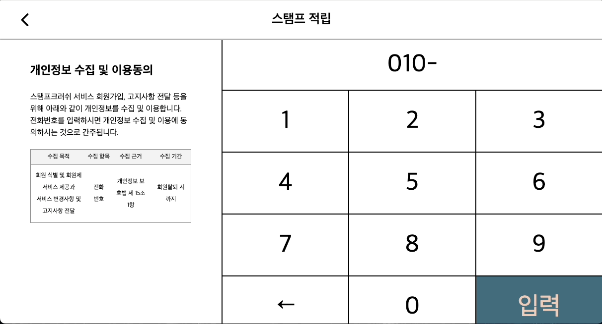</td>
      <td>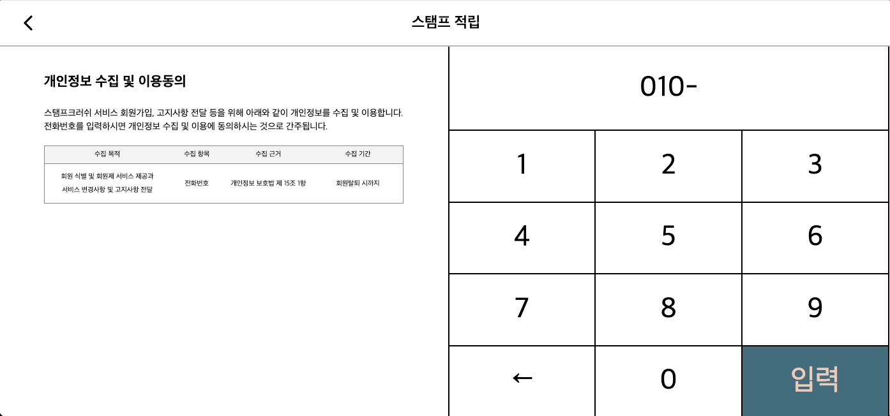</td>
    <tr>
  </table>

  <table>
    <tr>
      <td><strong>쿠폰을 커스터마이징한 경우 사용자가 설정한 스탬프 위치와 순서에 맞게</strong> 스탬프가 찍힙니다.</td>
    </tr>
    <tr>
      <td>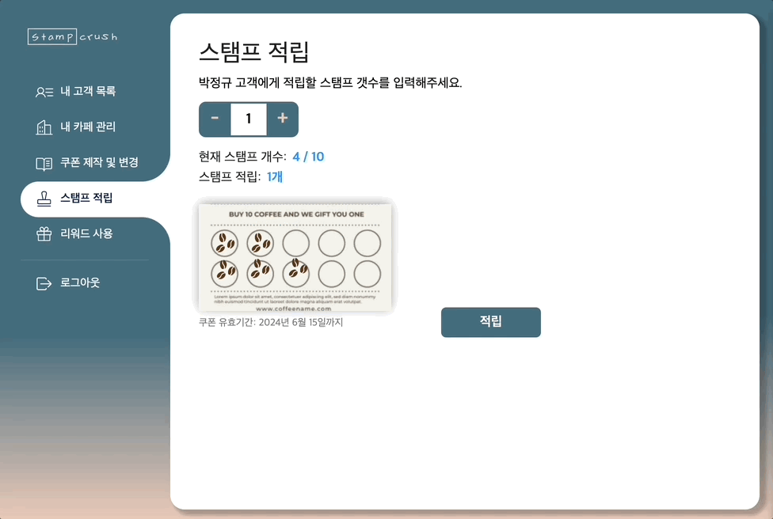</td>
    </tr>
  </table>

  <table>
    <tr>
      <td>적립하고자 하는 스탬프의 개수가 쿠폰 최대 스탬프 개수를 넘어가면 새 쿠폰을 발급하여 스탬프를 적립합니다.</td>
    </tr>
    <tr>
      <td>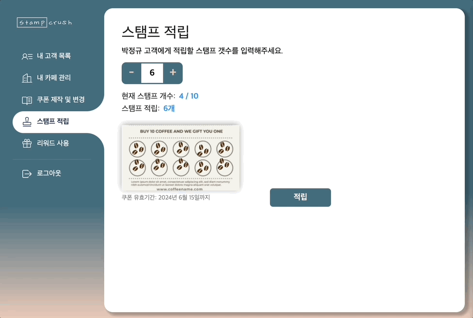</td>
    </tr>
  </table>

   
   

## 카페 관리(사장 모드)

### 카페 정보 입력

  <table>
    <tr>
      <td>
        <h3>[사장모드]</h3> 
        
카페 대표 이미지, 전화번호, 영업 시간, 소개글 등을 입력할 수 있습니다.
</td>
      <td>
        <h3>[고객모드]</h3> 
        
쿠폰을 터치하여 카페의 정보를 확인할 수 있습니다.

      </td>
    </tr>
    <tr>
      <td>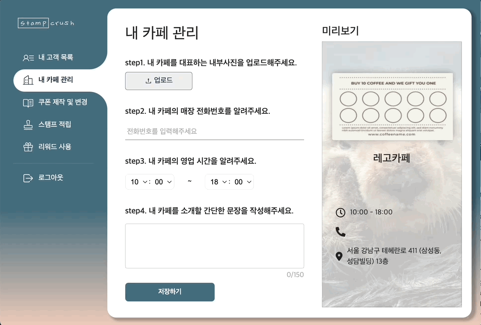</td>
      <td></td>
    <tr>
  </table>
   
   

### 고객 관리

  <table>
    <tr>
      <td>
        <h3>고객 목록 필터링</h3>
        
스탬프 크러쉬 서비스 가입(회원) / 미가입(임시), 최근 방문순, 리워드 순 등 필터링이 가능합니다.

      </td>
    </tr>
    <tr>
      <td>
        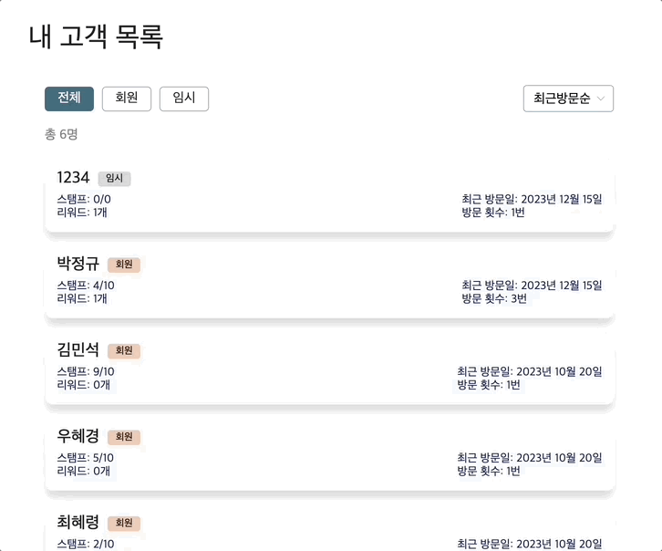
      </td>
    </tr>
  </table>

   
   
   

## 보유 쿠폰 조회 기능(고객 모드)

  <table>
    <tr>
      <td width="250">
        <h3>쿠폰 접기/펼치기</h3> 
        
다수의 쿠폰이 존재할 때 쿠폰을 모아서 볼 수도 있고, 펼쳐서 볼 수도 있습니다.

      </td>
      <td width="250">
        <h3>즐겨찾기 등록/해제</h3> 
        
쿠폰 오른쪽 위의 별모양 아이콘을 눌러 카페 즐겨찾기 등록/해제할 수 있습니다.

      </td>
      <td width="250">
        <h3>즐겨찾기 모아보기</h3> 
        
즐겨찾기 된 쿠폰만을 확인할 수 있습니다.

      </td>
    </tr>
    <tr>
      <td></td>
      <td></td>
      <td>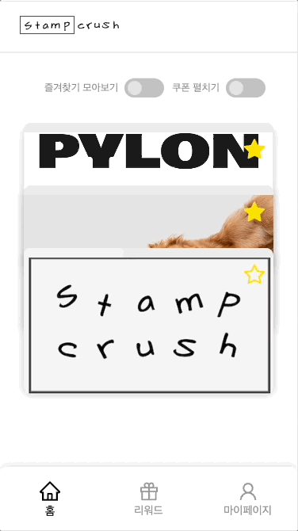</td>
    <tr>
  </table>
  
   
   
   

---

## 팀원 소개

|                                                                                               Frontend                                                                                               |                                                                                                        Frontend                                                                                                         |                                                                                                       Frontend                                                                                                        |
| :--------------------------------------------------------------------------------------------------------------------------------------------------------------------------------------------------: | :---------------------------------------------------------------------------------------------------------------------------------------------------------------------------------------------------------------------: | :-------------------------------------------------------------------------------------------------------------------------------------------------------------------------------------------------------------------: |
|                                                                                                                     |                                                                                                                                        |                                                                                                                                      |
|                                                                              [라잇](https://github.com/kangyeongmin) ✨                                                                              |                                                                                         [윤생](https://github.com/2yunseong) 🐿️                                                                                         |                                                                                       [레고](https://github.com/regularPark) 🦦                                                                                       |
|                                                                                          팀원들이 본 라잇은                                                                                          |                                                                                                   팀원들이 본 윤생은                                                                                                    |                                                                                                  팀원들이 본 레고는                                                                                                   |
| 🫀 책임감 있고, 팀에 주인의식을 가지는 기획자   ⭐️ 스탬프크러쉬의 비타민   🤔 고객의 입장에서 한 번 더 생각해보는 비지니스 전문가   👩🏻‍💻 언어 사용에 있어 기본기가 좋고 학습속도가 빨라요 | 👀 다양한 영역에 대한 이해력과 통찰력   😎 맡은 바를 책임감 있게 해내고야 마는 멋쟁이   🧑‍💻 새 지식에 대한 흡수력이 놀랄만큼 좋아요. 동시에 기술 도입에 있어서는 신중하고 합리적이에요   📃 문서화하면 윤생! | 🧑🏻 우리팀 큰아빠. 밤, 낮, 주말 가리지 않고 성실하게 개발하는. 어려운 기능도 뚝딱뚝딱   💪🏻 끈기있게 문제를 해결하려는 자세가 인상깊다   👨🏻‍💻 요구사항 변동에 유연하게 대응할 수 있는 개발자   🐛 버그 학살자 |

|                                                                                                   Backend                                                                                                    |                                                                                                    Backend                                                                                                     |                                                                                           Backend                                                                                           |                                                                                                       Backend                                                                                                       |
| :----------------------------------------------------------------------------------------------------------------------------------------------------------------------------------------------------------: | :------------------------------------------------------------------------------------------------------------------------------------------------------------------------------------------------------------: | :-----------------------------------------------------------------------------------------------------------------------------------------------------------------------------------------: | :-----------------------------------------------------------------------------------------------------------------------------------------------------------------------------------------------------------------: |
|                                                                                                                            |                                                                         |                                                                                                            |                                                                                                                                    |
|                                                                                   [깃짱](https://github.com/gitchannn) 🌟                                                                                    |                                                                                   [하디](https://github.com/jundonghyuk) 🌰                                                                                    |                                                                            [레오](https://github.com/youngh0) 🐆                                                                            |                                                                                        [제나](https://github.com/yenawee) 🌱                                                                                        |
|                                                                                              팀원들이 본 깃짱은                                                                                              |                                                                                               팀원들이 본 하디는                                                                                               |                                                                                     팀원들이 본 레오는                                                                                      |                                                                                                 팀원들이 본 제나는                                                                                                  |
| 😆 분위기 메이커   👑 엣지케이스의 여왕. 생각지도 못한 부분까지 고려하는 경우가 많아서 놀랄 때가 많아요   ✒️ 스탬프크러쉬 회고 장인. 모든 일을 글로서 정리하는 능력이 탁월한.   🎉 아이디어 뱅크 | 🔫 문제 해결사   🙂 상수(constant) 같은 느낌이에요. 감정 기복없이 항상 꾸준하게 잘해줘요   🎤 복잡하고 장황한 회의를 지혜롭고 핵심있게 이끌어가는 mc   🧐 생각을 깊게 해서 코드 리뷰가 질이 좋아요 | 🥰️ 우리팀 인기쟁이   🙌 백엔드 개발자로서 갖춰야 할 여러 스킬들을 두루두루 잘해요   💡 반복적인 개발에 지칠 때 새로운 인사이트를 많이 가져오고, 여기저기서 본 지식을 잘 공유해줘요 | 🤝 프론트, 백엔드, 서비스 이용자 사이에서 의견을 부드럽게 조율하는 개발자   🗓️ 팀원들이 놓친 부분을 소름돋게 항상 캐치해주는. 분야를 가리지 않고, 전반적인 프로젝트를 점검하고 통솔하는.   🛠️ 인프라 마스터 |

## 인프라 구조

### 클라이언트 요청 흐름도

### CI/CD

