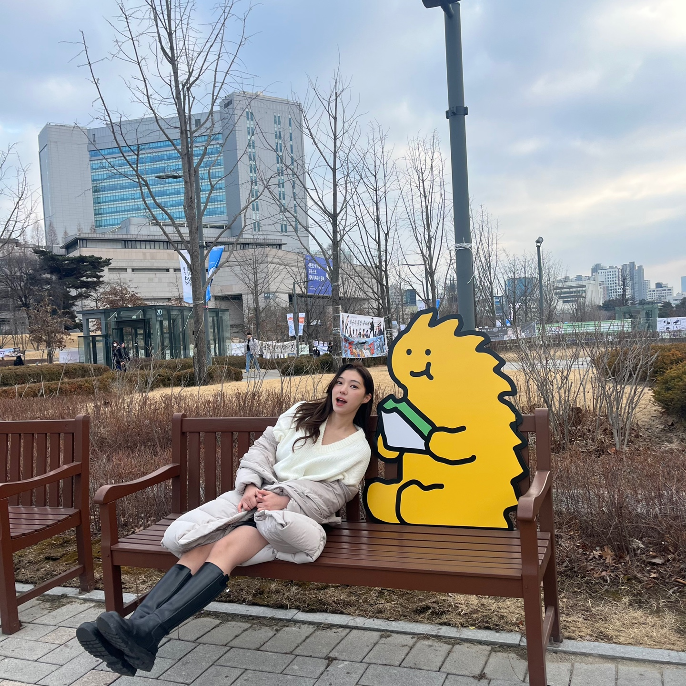

  
  <h2> 흩어진 쿠폰 한번에 관리하자! </h2>
 
사장 모드 : stampcrush.site/admin
 
고객 모드 : stampcrush.site
   
   
  <strong>스탬프크러쉬</strong>는 온라인 쿠폰 적립 및 관리 플랫폼으로
   
  카페 사장님에게 개성 있는 쿠폰 제작과 고객에게 간편한 적립을 제공해주는 서비스입니다.
   
   

[서비스 소개글 바로가기](https://github.com/woowacourse-teams/2023-stamp-crush/wiki)

[서비스 소개 페이지 바로가기](https://sites.google.com/woowahan.com/woowacourse-demo-5th/프로젝트/스탬프크러쉬)

ㅣ
## 팀원 소개

## 스탬프크러쉬 2기 `2023.10 ~ ing`

|                                       프론트엔드                                       |                                        백엔드                                         |                    기획/마케팅                    |                     디자인                     |          
|:---------------------------------------------------------------------------------:|:----------------------------------------------------------------------------------:|:--------------------------------------------:|:-------------------------------------------:|
|  |  |  |  |
|                      [윤생](https://github.com/2yunseong) 🐿️                       |                      [깃짱](https://github.com/gitchannn)   🌟                       |                     박성주                      |                     조강미                     |      

## 스탬프크러쉬 1기 `2023.07 ~ 2023.10`

|                                                             Frontend                                                              |                                                                  Frontend                                                                   |                                                                     Frontend                                                                      |                                                              Backend                                                               |                                                                 Backend                                                                  |                                                       Backend                                                        |                                                               Backend                                                                |
|:---------------------------------------------------------------------------------------------------------------------------------:|:-------------------------------------------------------------------------------------------------------------------------------------------:|:-------------------------------------------------------------------------------------------------------------------------------------------------:|:----------------------------------------------------------------------------------------------------------------------------------:|:----------------------------------------------------------------------------------------------------------------------------------------:|:--------------------------------------------------------------------------------------------------------------------:|:------------------------------------------------------------------------------------------------------------------------------------:|
|                                                  |                                                            |                                                                  |                                                  |   |                                     |                                                     |
|                                             [라잇](https://github.com/kangyeongmin)  ✨                                              |                                                   [윤생](https://github.com/2yunseong) 🐿️                                                    |                                                      [레고](https://github.com/regularPark) 🦦                                                      |                                              [깃짱](https://github.com/gitchannn)   🌟                                               |                                                 [하디](https://github.com/jundonghyuk) 🌰                                                  |                                         [레오](https://github.com/youngh0) 🐆                                          |                                                 [제나](https://github.com/yenawee) 🌱                                                  |
|                                                            팀원들이 본 라잇은                                                             |                                                                 팀원들이 본 윤생은                                                                  |                                                                    팀원들이 본 레고는                                                                     |                                                             팀원들이 본 깃짱은                                                             |                                                                팀원들이 본 하디는                                                                |                                                      팀원들이 본 레오는                                                      |                                                              팀원들이 본 제나는                                                              |
| 🫀 책임감 있고, 팀에 주인의식을 가지는 기획자   ⭐️ 스탬프크러쉬의 비타민   🤔 고객의 입장에서 한 번 더 생각해보는 비지니스 전문가   👩🏻‍💻 언어 사용에 있어 기본기가 좋고 학습속도가 빨라요 | 👀 다양한 영역에 대한 이해력과 통찰력   😎 맡은 바를 책임감 있게 해내고야 마는 멋쟁이   🧑‍💻 새 지식에 대한 흡수력이 놀랄만큼 좋아요. 동시에 기술 도입에 있어서는 신중하고 합리적이에요   📃 문서화하면 윤생! | 🧑🏻 우리팀 큰아빠. 밤, 낮, 주말 가리지 않고 성실하게 개발하는. 어려운 기능도 뚝딱뚝딱   💪🏻 끈기있게 문제를 해결하려는 자세가 인상깊다   👨🏻‍💻 요구사항 변동에 유연하게 대응할 수 있는 개발자   🐛 버그 학살자 | 😆 분위기 메이커   👑 엣지케이스의 여왕. 생각지도 못한 부분까지 고려하는 경우가 많아서 놀랄 때가 많아요   ✒️ 스탬프크러쉬 회고 장인. 모든 일을 글로서 정리하는 능력이 탁월한.   🎉 아이디어 뱅크 | 🔫 문제 해결사   🙂 상수(constant) 같은 느낌이에요. 감정 기복없이 항상 꾸준하게 잘해줘요   🎤 복잡하고 장황한 회의를 지혜롭고 핵심있게 이끌어가는 mc   🧐 생각을 깊게 해서 코드 리뷰가 질이 좋아요 | 🥰️ 우리팀 인기쟁이   🙌 백엔드 개발자로서 갖춰야 할 여러 스킬들을 두루두루 잘해요   💡 반복적인 개발에 지칠 때 새로운 인사이트를 많이 가져오고, 여기저기서 본 지식을 잘 공유해줘요 | 🤝 프론트, 백엔드, 서비스 이용자 사이에서 의견을 부드럽게 조율하는 개발자   🗓️ 팀원들이 놓친 부분을 소름돋게 항상 캐치해주는. 분야를 가리지 않고, 전반적인 프로젝트를 점검하고 통솔하는.   🛠️ 인프라 마스터 

## 인프라 구조

### 클라이언트 요청 흐름도

### CI/CD

